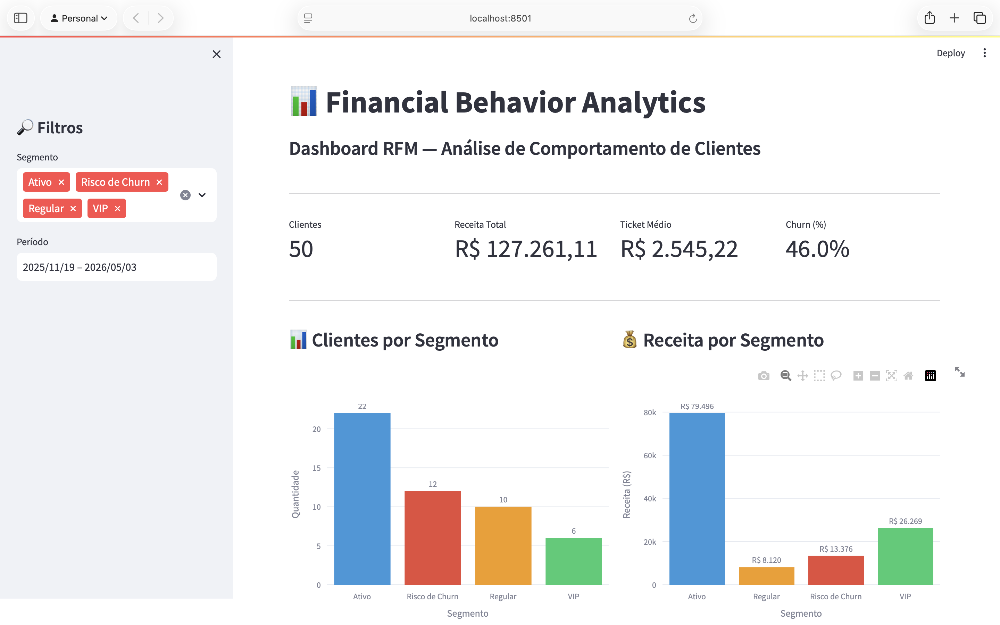
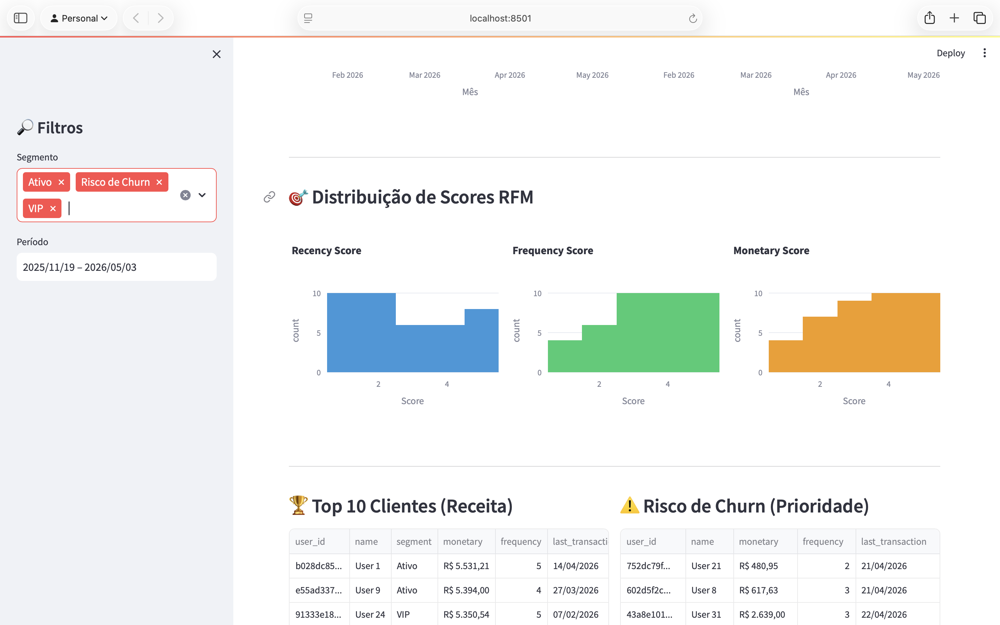
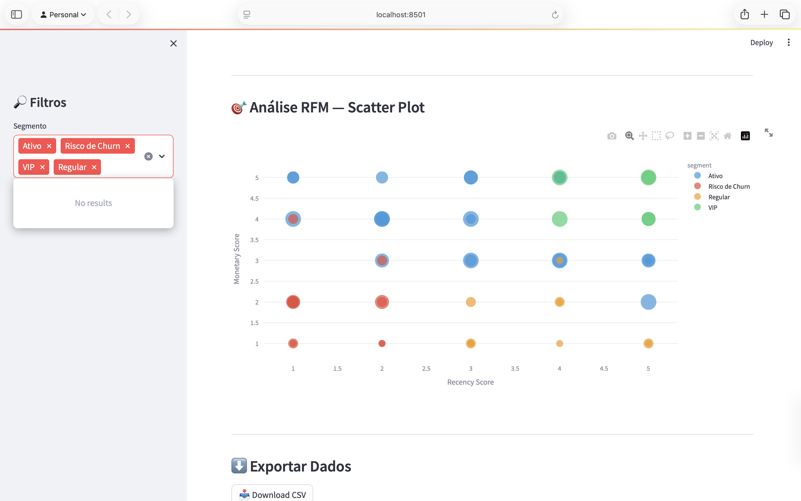

# 📊 Financial Behavior Analytics — Pipeline End-to-End de Analytics Engineering

[](https://www.postgresql.org/)
[](https://www.getdbt.com/)
[](https://streamlit.io/)
[](https://github.com/rodrigodesouza7/financial-behavior-analytics/actions)
[](https://www.python.org/)
[](https://opensource.org/licenses/MIT)

> Sistema completo de analytics engineering aplicando arquitetura multicamadas (OLTP → dbt → BI) para análise de comportamento financeiro com segmentação RFM, visualizações interativas e pipeline automatizado via CI/CD.

**Tecnologias:** PostgreSQL | dbt | Streamlit | Plotly | GitHub Actions | Docker

---

## 📊 Visão Geral

**Objetivo:** Construir pipeline de dados end-to-end que transforma dados transacionais (OLTP) em insights de negócio através de camadas de transformação (dbt) e dashboard interativo (Streamlit).

**Problema de Negócio:** Empresas financeiras precisam responder:

- Quem são os clientes mais valiosos?
- Quem está abandonando o sistema (churn)?
- Como os usuários gastam?

**Solução:** Pipeline multicamadas com segmentação RFM (Recency, Frequency, Monetary) para identificar padrões de comportamento e automatizar análises.

**Volume:** 50 usuários | 204 transações | Segmentação: VIP, Ativo, Regular, Risco de Churn

---

## 🛠️ Tech Stack

### Backend

- **PostgreSQL 15** — Banco transacional (OLTP)
- **dbt 1.7.0** — Orquestração do pipeline de transformação

### Frontend

- **Streamlit 1.31.0** — Dashboard interativo
- **Plotly 5.18.0** — Visualizações avançadas
- **Pandas 2.2.0** — Manipulação de dados

### DevOps

- **GitHub Actions** — CI/CD automatizado
- **Docker** (opcional) — Containerização
- **Git** — Versionamento com Conventional Commits

### Modelagem

- **Pipeline Multicamadas** — RAW → STAGING → CORE → ANALYTICS
- **Modelo RFM** — Segmentação de clientes

---

## 🏗️ Arquitetura do Sistema

┌─────────────────────────────────────────────────────┐
│ ARQUITETURA DO PIPELINE │
└─────────────────────────────────────────────────────┘
┌──────────────────┐
│ PostgreSQL │
│ (OLTP) │
│ │
│ • users │
│ • accounts │
│ • categories │
│ • transactions │
└────────┬─────────┘
│
│ raw data
▼
┌──────────────────┐
│ dbt Pipeline │
│ │
│ staging/ │
│ └─ stg_trans │
│ │
│ core/ │
│ └─ fct_trans │
│ │
│ marts/ │
│ └─ mart_rfm │
└────────┬─────────┘
│
│ analytics
▼
┌──────────────────┐
│ Streamlit │
│ Dashboard │
│ │
│ • KPIs │
│ • Gráficos │
│ • Filtros │
└────────┬─────────┘
│
▼
┌──────────────────┐
│ GitHub Actions │
│ (CI/CD) │
│ │
│ • dbt test │
│ • validations │
└──────────────────┘

---

## 🗄️ Modelo de Dados


### Camadas do Pipeline

#### 📂 OLTP (PostgreSQL)

- **`users`** — Cadastro de usuários
- **`accounts`** — Contas financeiras
- **`categories`** — Categorias de transações
- **`transactions`** — Transações financeiras (income/expense)

#### 🔄 STAGING (dbt)

- **`stg_transactions`** — Limpeza e padronização

#### 📊 CORE (dbt)

- **`fct_transactions`** — Fato de transações (join com accounts)

#### 📈 ANALYTICS (dbt)

- **`mart_rfm`** — Segmentação RFM com scores e classificação

### 🔑 Decisões Técnicas

✅ **Materialização:** Views em staging/core, Table em marts  
✅ **Testes de qualidade:** 12 testes dbt (not_null, unique, accepted_values)  
✅ **Integridade referencial:** Foreign Keys entre tabelas OLTP  
✅ **Formatação BR:** Valores monetários (R$ 1.234,56) e datas (DD/MM/YYYY)

---

## ✨ Features

### 📊 Pipeline de Dados

- ✅ Arquitetura multicamadas (staging → core → marts)
- ✅ Transformações SQL via dbt
- ✅ Testes automatizados de qualidade
- ✅ Modelo RFM completo (recency, frequency, monetary)

### 📈 Dashboard Interativo

- ✅ 4 KPIs principais (clientes, receita, ticket médio, churn)
- ✅ 8 visualizações Plotly (gráficos de barras, linhas, scatter, histogramas)
- ✅ Filtros dinâmicos (segmento + período temporal)
- ✅ Export de dados (CSV com timestamp)
- ✅ Formatação padrão brasileiro (moeda e datas)

### ⚙️ DevOps

- ✅ CI/CD via GitHub Actions
- ✅ Testes automatizados em cada PR
- ✅ Conventional Commits
- ✅ Validação de schema + seeds + dbt

### 📚 Documentação

- ✅ README completo
- ✅ Diagramas de arquitetura
- ✅ Screenshots do dashboard
- ✅ Comentários em SQL

---

## 🚀 Como Reproduzir

### Pré-requisitos

- **PostgreSQL 15** ou superior
- **Python 3.11+**
- **Git**

### 1. Clonar repositório

```bash
git clone https://github.com/rodrigodesouza7/financial-behavior-analytics.git
cd financial-behavior-analytics
```

### 2. Criar ambiente virtual

```bash
python3 -m venv venv
source venv/bin/activate  # Linux/Mac
# ou
venv\Scripts\activate     # Windows
```

### 3. Instalar dependências

```bash
pip install -r requirements.txt
```

### 4. Configurar banco de dados

#### Opção A: PostgreSQL local

```bash
# Criar banco
createdb finance_db

# Executar DDL
psql -d finance_db -f database/ddl/01_create_schema.sql

# Inserir dados
psql -d finance_db -f database/seeds/01_seed_data.sql
```

#### Opção B: Docker

```bash
docker run --name finance-db \
  -e POSTGRES_USER=postgres \
  -e POSTGRES_PASSWORD=postgres \
  -e POSTGRES_DB=finance_db \
  -p 5432:5432 \
  -d postgres:15
```

### 5. Configurar variáveis de ambiente

```bash
cp .env.example .env
```

Edite `.env`:

```bash
DB_HOST=localhost
DB_PORT=5432
DB_NAME=finance_db
DB_USER=postgres
DB_PASSWORD=
```

### 6. Executar dbt

```bash
cd dbt_project
dbt debug   # validar conexão
dbt run     # executar transformações
dbt test    # rodar testes de qualidade
```

### 7. Rodar dashboard

```bash
streamlit run streamlit_app/app.py
```

Acesse: http://localhost:8501

---

## 📈 Dashboard — Screenshots

### Visão Geral



**KPIs principais:**

- Total de clientes
- Receita total (formato BR: R$ 127.261,11)
- Ticket médio
- Taxa de churn

**Visualizações:**

- Clientes por segmento
- Receita por segmento

---

### Análise RFM



**Componentes:**

- Distribuição de scores RFM (3 histogramas)
- Top 10 clientes por receita
- Usuários em risco de churn (prioridade)
- Scatter plot interativo (Recency × Monetary)

---

### Filtros Aplicados



**Recursos:**

- Filtro por segmento (multiselect)
- Filtro temporal (date range)
- Atualização dinâmica de todos os gráficos
- UUIDs truncados para melhor visualização

---

## 🧪 CI/CD Pipeline

### GitHub Actions

Workflow automatizado que executa em todo push/PR:

```yaml
✅ Setup PostgreSQL (container)
✅ Instalar dependências Python
✅ Criar schema do banco
✅ Inserir dados de seed
✅ Configurar dbt profile
✅ Executar dbt run
✅ Executar dbt test
✅ Validar importação do Streamlit
```

**Status:** [](https://github.com/rodrigodesouza7/financial-behavior-analytics/actions)

---

## 📂 Estrutura do Projeto

financial-behavior-analytics/
├── .github/
│ ├── workflows/
│ │ └── ci.yml # CI/CD pipeline
│ └── PULL_REQUEST_TEMPLATE.md
├── database/
│ ├── ddl/
│ │ └── 01_create_schema.sql # Schema OLTP
│ └── seeds/
│ └── 01_seed_data.sql # Dados iniciais
├── dbt_project/
│ ├── models/
│ │ ├── staging/
│ │ │ ├── stg_transactions.sql
│ │ │ └── schema.yml
│ │ ├── core/
│ │ │ ├── fct_transactions.sql
│ │ │ └── schema.yml
│ │ └── marts/
│ │ ├── mart_rfm.sql
│ │ └── schema.yml
│ └── dbt_project.yml
├── streamlit_app/
│ └── app.py # Dashboard completo
├── docs/
│ └── images/
│ ├── dashboard-overview.png
│ ├── rfm-analysis.png
│ ├── filters.png
│ └── database-schema.png
├── .env.example
├── .gitignore
├── requirements.txt
└── README.md

---

## 🎓 Aprendizados Técnicos

### Analytics Engineering

- **Pipeline multicamadas** (staging → core → marts)
- **dbt** para orquestração e testes
- **Modelo RFM** para segmentação de clientes

### Data Engineering

- **Modelagem de dados** (OLTP + analytics)
- **ETL/ELT** via dbt
- **Qualidade de dados** com testes automatizados

### BI & Visualização

- **Streamlit** para dashboards interativos
- **Plotly** para gráficos avançados
- **UX** com filtros dinâmicos e formatação BR

### DevOps

- **CI/CD** com GitHub Actions
- **Infraestrutura como código** (DDL versionado)
- **Conventional Commits** para histórico limpo

---

## 📝 Status do Projeto

- [x] Modelagem de dados (OLTP + analytics)
- [x] Pipeline dbt completo (staging → core → marts)
- [x] Dashboard Streamlit com 8 visualizações
- [x] Testes automatizados (12 testes dbt)
- [x] CI/CD funcional (GitHub Actions)
- [x] Formatação brasileira (moeda + datas)
- [x] Documentação completa
- [x] Screenshots do dashboard
- [x] Diagramas de arquitetura

---

## 👤 Sobre o Autor

**Rodrigo de Souza Silva**  
Profissional de Tecnologia da Informação com formação em Sistemas de Informação e pós-graduação em Data Science, Machine Learning e IA.

- 🔗 **LinkedIn:** [linkedin.com/in/rodrigodesouzasilva](https://www.linkedin.com/in/rodrigodesouzasilva)
- 💻 **GitHub:** [github.com/rodrigodesouza7](https://github.com/rodrigodesouza7)

---

## 📄 Licença

MIT License — Projeto de portfólio profissional

[](https://www.postgresql.org/)
[](https://www.getdbt.com/)
[](https://streamlit.io/)
[](https://github.com/rodrigodesouza7/financial-behavior-analytics/actions)
[](https://www.python.org/)
[](https://opensource.org/licenses/MIT)

> Sistema completo de analytics engineering aplicando arquitetura multicamadas (OLTP → dbt → BI) para análise de comportamento financeiro com segmentação RFM, visualizações interativas e pipeline automatizado via CI/CD.

**Tecnologias:** PostgreSQL | dbt | Streamlit | Plotly | GitHub Actions | Docker

---

## 📊 Visão Geral

**Objetivo:** Construir pipeline de dados end-to-end que transforma dados transacionais (OLTP) em insights de negócio através de camadas de transformação (dbt) e dashboard interativo (Streamlit).

**Problema de Negócio:** Empresas financeiras precisam responder:

- Quem são os clientes mais valiosos?
- Quem está abandonando o sistema (churn)?
- Como os usuários gastam?

**Solução:** Pipeline multicamadas com segmentação RFM (Recency, Frequency, Monetary) para identificar padrões de comportamento e automatizar análises.

**Volume:** 50 usuários | 204 transações | Segmentação: VIP, Ativo, Regular, Risco de Churn

---

## 🛠️ Tech Stack

### Backend

- **PostgreSQL 15** — Banco transacional (OLTP)
- **dbt 1.7.0** — Orquestração do pipeline de transformação

### Frontend

- **Streamlit 1.31.0** — Dashboard interativo
- **Plotly 5.18.0** — Visualizações avançadas
- **Pandas 2.2.0** — Manipulação de dados

### DevOps

- **GitHub Actions** — CI/CD automatizado
- **Docker** (opcional) — Containerização
- **Git** — Versionamento com Conventional Commits

### Modelagem

- **Pipeline Multicamadas** — RAW → STAGING → CORE → ANALYTICS
- **Modelo RFM** — Segmentação de clientes

---

## 🏗️ Arquitetura do Sistema

┌─────────────────────────────────────────────────────┐
│ ARQUITETURA DO PIPELINE │
└─────────────────────────────────────────────────────┘
┌──────────────────┐
│ PostgreSQL │
│ (OLTP) │
│ │
│ • users │
│ • accounts │
│ • categories │
│ • transactions │
└────────┬─────────┘
│
│ raw data
▼
┌──────────────────┐
│ dbt Pipeline │
│ │
│ staging/ │
│ └─ stg_trans │
│ │
│ core/ │
│ └─ fct_trans │
│ │
│ marts/ │
│ └─ mart_rfm │
└────────┬─────────┘
│
│ analytics
▼
┌──────────────────┐
│ Streamlit │
│ Dashboard │
│ │
│ • KPIs │
│ • Gráficos │
│ • Filtros │
└────────┬─────────┘
│
▼
┌──────────────────┐
│ GitHub Actions │
│ (CI/CD) │
│ │
│ • dbt test │
│ • validations │
└──────────────────┘

---

## 🗄️ Modelo de Dados


### Camadas do Pipeline

#### 📂 OLTP (PostgreSQL)

- **`users`** — Cadastro de usuários
- **`accounts`** — Contas financeiras
- **`categories`** — Categorias de transações
- **`transactions`** — Transações financeiras (income/expense)

#### 🔄 STAGING (dbt)

- **`stg_transactions`** — Limpeza e padronização

#### 📊 CORE (dbt)

- **`fct_transactions`** — Fato de transações (join com accounts)

#### 📈 ANALYTICS (dbt)

- **`mart_rfm`** — Segmentação RFM com scores e classificação

### 🔑 Decisões Técnicas

✅ **Materialização:** Views em staging/core, Table em marts  
✅ **Testes de qualidade:** 12 testes dbt (not_null, unique, accepted_values)  
✅ **Integridade referencial:** Foreign Keys entre tabelas OLTP  
✅ **Formatação BR:** Valores monetários (R$ 1.234,56) e datas (DD/MM/YYYY)

---

## ✨ Features

### 📊 Pipeline de Dados

- ✅ Arquitetura multicamadas (staging → core → marts)
- ✅ Transformações SQL via dbt
- ✅ Testes automatizados de qualidade
- ✅ Modelo RFM completo (recency, frequency, monetary)

### 📈 Dashboard Interativo

- ✅ 4 KPIs principais (clientes, receita, ticket médio, churn)
- ✅ 8 visualizações Plotly (gráficos de barras, linhas, scatter, histogramas)
- ✅ Filtros dinâmicos (segmento + período temporal)
- ✅ Export de dados (CSV com timestamp)
- ✅ Formatação padrão brasileiro (moeda e datas)

### ⚙️ DevOps

- ✅ CI/CD via GitHub Actions
- ✅ Testes automatizados em cada PR
- ✅ Conventional Commits
- ✅ Validação de schema + seeds + dbt

### 📚 Documentação

- ✅ README completo
- ✅ Diagramas de arquitetura
- ✅ Screenshots do dashboard
- ✅ Comentários em SQL

---

## 🚀 Como Reproduzir

### Pré-requisitos

- **PostgreSQL 15** ou superior
- **Python 3.11+**
- **Git**

### 1. Clonar repositório

```bash
git clone https://github.com/rodrigodesouza7/financial-behavior-analytics.git
cd financial-behavior-analytics
```

### 2. Criar ambiente virtual

```bash
python3 -m venv venv
source venv/bin/activate  # Linux/Mac
# ou
venv\Scripts\activate     # Windows
```

### 3. Instalar dependências

```bash
pip install -r requirements.txt
```

### 4. Configurar banco de dados

#### Opção A: PostgreSQL local

```bash
# Criar banco
createdb finance_db

# Executar DDL
psql -d finance_db -f database/ddl/01_create_schema.sql

# Inserir dados
psql -d finance_db -f database/seeds/01_seed_data.sql
```

#### Opção B: Docker

```bash
docker run --name finance-db \
  -e POSTGRES_USER=postgres \
  -e POSTGRES_PASSWORD=postgres \
  -e POSTGRES_DB=finance_db \
  -p 5432:5432 \
  -d postgres:15
```

### 5. Configurar variáveis de ambiente

```bash
cp .env.example .env
```

Edite `.env`:

```bash
DB_HOST=localhost
DB_PORT=5432
DB_NAME=finance_db
DB_USER=postgres
DB_PASSWORD=
```

### 6. Executar dbt

```bash
cd dbt_project
dbt debug   # validar conexão
dbt run     # executar transformações
dbt test    # rodar testes de qualidade
```

### 7. Rodar dashboard

```bash
streamlit run streamlit_app/app.py
```

Acesse: http://localhost:8501

---

## 📈 Dashboard — Screenshots

### Visão Geral


**KPIs principais:**

- Total de clientes
- Receita total (formato BR: R$ 127.261,11)
- Ticket médio
- Taxa de churn

**Visualizações:**

- Clientes por segmento
- Receita por segmento

---

### Análise RFM


**Componentes:**

- Distribuição de scores RFM (3 histogramas)
- Top 10 clientes por receita
- Usuários em risco de churn (prioridade)
- Scatter plot interativo (Recency × Monetary)

---

### Filtros Aplicados


**Recursos:**

- Filtro por segmento (multiselect)
- Filtro temporal (date range)
- Atualização dinâmica de todos os gráficos
- UUIDs truncados para melhor visualização

---

## 🧪 CI/CD Pipeline

### GitHub Actions

Workflow automatizado que executa em todo push/PR:

```yaml
✅ Setup PostgreSQL (container)
✅ Instalar dependências Python
✅ Criar schema do banco
✅ Inserir dados de seed
✅ Configurar dbt profile
✅ Executar dbt run
✅ Executar dbt test
✅ Validar importação do Streamlit
```

**Status:** [](https://github.com/rodrigodesouza7/financial-behavior-analytics/actions)

---

## 📂 Estrutura do Projeto

financial-behavior-analytics/
├── .github/
│ ├── workflows/
│ │ └── ci.yml # CI/CD pipeline
│ └── PULL_REQUEST_TEMPLATE.md
├── database/
│ ├── ddl/
│ │ └── 01_create_schema.sql # Schema OLTP
│ └── seeds/
│ └── 01_seed_data.sql # Dados iniciais
├── dbt_project/
│ ├── models/
│ │ ├── staging/
│ │ │ ├── stg_transactions.sql
│ │ │ └── schema.yml
│ │ ├── core/
│ │ │ ├── fct_transactions.sql
│ │ │ └── schema.yml
│ │ └── marts/
│ │ ├── mart_rfm.sql
│ │ └── schema.yml
│ └── dbt_project.yml
├── streamlit_app/
│ └── app.py # Dashboard completo
├── docs/
│ └── images/
│ ├── dashboard-overview.png
│ ├── rfm-analysis.png
│ ├── filters.png
│ └── database-schema.png
├── .env.example
├── .gitignore
├── requirements.txt
└── README.md

---

## 🎓 Aprendizados Técnicos

### Analytics Engineering

- **Pipeline multicamadas** (staging → core → marts)
- **dbt** para orquestração e testes
- **Modelo RFM** para segmentação de clientes

### Data Engineering

- **Modelagem de dados** (OLTP + analytics)
- **ETL/ELT** via dbt
- **Qualidade de dados** com testes automatizados

### BI & Visualização

- **Streamlit** para dashboards interativos
- **Plotly** para gráficos avançados
- **UX** com filtros dinâmicos e formatação BR

### DevOps

- **CI/CD** com GitHub Actions
- **Infraestrutura como código** (DDL versionado)
- **Conventional Commits** para histórico limpo

---

## 📝 Status do Projeto

- [x] Modelagem de dados (OLTP + analytics)
- [x] Pipeline dbt completo (staging → core → marts)
- [x] Dashboard Streamlit com 8 visualizações
- [x] Testes automatizados (12 testes dbt)
- [x] CI/CD funcional (GitHub Actions)
- [x] Formatação brasileira (moeda + datas)
- [x] Documentação completa
- [x] Screenshots do dashboard
- [x] Diagramas de arquitetura

---

## 👤 Sobre o Autor

**Rodrigo de Souza Silva**  
Profissional de Tecnologia da Informação com formação em Sistemas de Informação e pós-graduação em Data Science, Machine Learning e IA.

- 🔗 **LinkedIn:** [linkedin.com/in/rodrigodesouzasilva](https://www.linkedin.com/in/rodrigodesouzasilva)
- 💻 **GitHub:** [github.com/rodrigodesouza7](https://github.com/rodrigodesouza7)

---

## 📄 Licença

MIT License — Projeto de portfólio profissional
